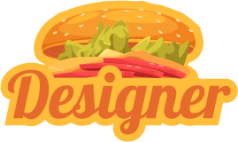
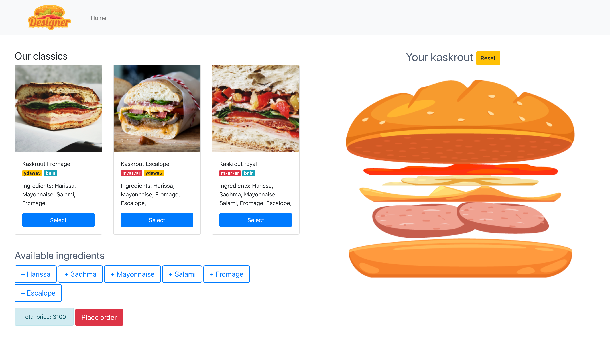

  

# Kaskrout designer

 Live react workshop 

( kaskrout means Sandwich in the Tunisian 🇹🇳 dialect)
 
  

### How to run this project

1. Clone the project using `git clone https://github.com/ghndr/kaskrout-designer.git`
2. Navigate to project directory `cd kaskrout-designer`
3. Run the command `npm install` to install the required dependencies to run the project
4. and finally run the following command `npm start` to start the project
5. Congrats your are now you have your own personal kaskrout designer, enjoy !

1. Organisations that use react
   - Airbnb, Uber, Facebook, Slack, Udemy...
2. Setting up the development environment
   - [ ] Nodejs https://nodejs.org/en/download/
3. Installing create-react-app globally
   - [ ] `npm i -g create-react-app`
4. Initializing a new a project with create-react-app
   - [ ] `create-react-app project_name`
5. Run the project
   - [ ] `npm start` in the console

#### Useful resources

- TraveryMedia React Crash Course https://www.youtube.com/watch?v=sBws8MSXN7A&t=5206s
- Udemy courses
  - https://www.udemy.com/course/react-the-complete-guide-incl-redux/
  - https://www.udemy.com/course/react-2nd-edition/

#### Contact the developer/instructor
⟶ [Mahmoud Ghandour](https://about.me/ghndr)
